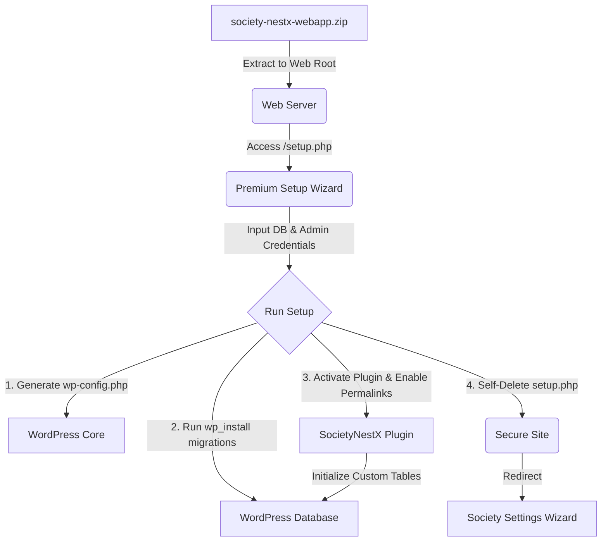

# SocietyNestX — Single-Shot Webapp

SocietyNestX is a premium, comprehensive society management system featuring automated maintenance, facility bookings, digital document vaults, community polls, and resident community engagement.

This repository packages the **SocietyNestX WordPress Plugin** alongside a dedicated, self-deleting setup wizard (`setup.php`) to create a "Single-Shot Webapp" bundle. Developers and administrators can deploy this bundle on any standard hosting environment to get a fully configured society management system up and running instantly.

---

## Links & Support
* **GitHub Repository**: [https://github.com/vishwas-r/Society-GovernX](https://github.com/vishwas-r/Society-GovernX)
* **Bug Tracker & Issues**: [https://github.com/vishwas-r/Society-GovernX/issues](https://github.com/vishwas-r/Society-GovernX/issues)

---

## Architecture Overview



1. **WordPress Core**: Automatically bundled from the latest official WordPress release.
2. **Setup Wizard (`setup.php`)**: A standalone Obsidian Nebula dark-themed installer that automates database creation, salt generation, `wp-config.php` creation, WordPress setup, plugin activation, and pretty permalinks configuration.
3. **SocietyNestX Plugin**: Pre-installed and auto-activated inside the `wp-content/plugins/society-nestx/` folder.

---

## Plugin Features & Core Modules

The **SocietyNestX** plugin delivers a full suite of administrative and community engagement tools:

* **Flat Management:** Track flat details, block structure, occupancy types (Owner/Tenant), and allocation.
* **Resident & Member Directory:** Register residents, manage member approvals, and search resident directory.
* **Rules & Regulations:** Post society rules, track violations, issue fines, and collect digital resident acknowledgments.
* **Staff & Vendor Management:** Keep records of society staff members, gatekeepers, and vendors with granular role-based capabilities.
* **Notice Board:** Dispatch real-time notices to residents via in-app feeds, emails, or WhatsApp alerts.
* **Democracy & Polls:** Create community polls, collect votes, and automatically compute results for transparent decision-making.
* **Facility & Amenity Booking:** Add facilities (e.g., clubhouse, gym, pool) and allow residents to book slots online.
* **Vehicle & Parking Management:** Track registered resident vehicles and assign parking bays.
* **Helpdesk & Requests:** Dedicated resident ticketing/request portal (My Requests) with customized approval workflows.
* **Finance, Billing & Ledger:** Generate maintenance bills, record payments, and track society financial ledgers with customizable billing cycles.

---

## Required Configurations & Settings

After setup, navigate to **GovernX > Settings** in the WordPress Admin Dashboard to configure your society:

1. **Society Profile:** Manage basic details (Society Name, Registration Number, Address, and Contact Info) and upload the society logo.
2. **Bank Settings:** Enter banking details (Account Name, Account Number, Bank Name, IFSC, UPI ID) used to generate dynamic payment links and receipts.
3. **Approval Workflow:** Configure registration/ticketing approval steps (e.g., decide whether new residents, tickets, or vehicles require manual admin approval or are auto-approved).
4. **Communication Settings:** Toggle active channels (In-App notifications, Email, or WhatsApp) and notification triggers for billing dues, rule violations, new notices, and reminders.
5. **Data & Maintenance:** Import or Export database tables (e.g., Residents list, Notice templates, Rules log) using CSV format for easy migration.

---

## Frontend Shortcodes

Render portal components on any frontend WordPress page using the following shortcodes:
* `[society_nestx_dashboard]` - Renders the complete Resident Dashboard (Notice feed, billing log, requests, facility bookings, and rule acknowledgments).
* `[society_nestx_notices]` - Renders a standalone public notice board.
* `[society_nestx_directory]` - Renders a searchable resident directory (accessible only to authorized logged-in residents).

---

## Build & Packaging Automation (Cross-Platform)

To pack the webapp bundle, we provide automation scripts for both Windows and Linux/macOS developers. These scripts fetch WordPress core, overlay the plugin source files and setup wizard, package it, and clean up temporary files.

### Windows (PowerShell)
Execute the PowerShell packager from the root directory:
```powershell
# Bypassing execution policy for the script run
powershell -ExecutionPolicy Bypass -File .\build-bundle.ps1
```

### Linux / macOS (Bash)
Execute the Bash packager from the root directory:
```bash
chmod +x build-bundle.sh
./build-bundle.sh
```

**Output**: A clean `society-nestx-webapp.zip` file will be generated in the root directory.

---

## Deployment & Installation

1. **Extract**: Upload and unzip the generated `society-nestx-webapp.zip` into your web server's public document root (e.g. Apache, Nginx, LocalWP, Laragon, or XAMPP).
2. **Launch Wizard**: Navigate to `http://your-site-url/setup.php` in a web browser.
3. **Database Configuration**:
   - Provide your Database Host, Database Name, Database Username, Password, and Table Prefix.
   - The wizard will automatically attempt to create the database if it doesn't exist.
4. **Site Administrator Details**:
   - Provide your Site Title, Admin Username, Password, and Email Address.
5. **Run Setup**: Click **Install & Run Setup**.
   - The installer creates `wp-config.php`.
   - Runs WordPress core migrations.
   - Activates the `SocietyNestX` plugin.
   - Flushes permalink rules for clean URLs.
   - Attempts to self-delete the `setup.php` file for security.
6. **Finalize**: The page will redirect you to the admin panel setup screen (`wp-admin/admin.php?page=snestx51-setup`) to configure your society identity, property structure (blocks, floors, flats), and financial details.

---

## Security Features

- **Re-run Block**: Once the site is configured, accessing `setup.php` will be blocked automatically.
- **Destructive Reset**: If you deliberately want to rebuild the website from scratch, `setup.php` provides a "Re-install From Scratch" button. Clicking this requires confirmation, drops all core and plugin database tables, deletes `wp-config.php`, and resets the setup environment.
- **Self-Deletion**: On successful installation, `setup.php` tries to delete itself from the file system. (If permissions prevent deletion, a notice will prompt the user to manually remove it).