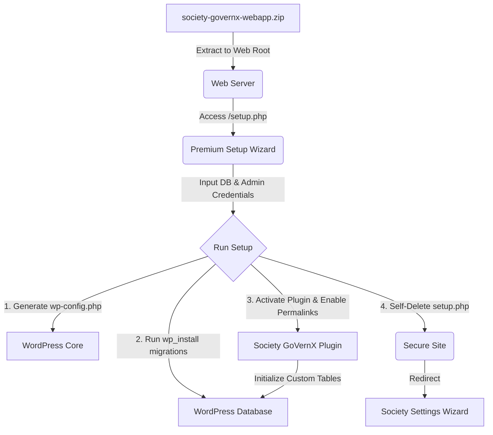

# Society GoVernX — Single-Shot Webapp

Society GoVernX is a premium, comprehensive society management system featuring automated maintenance, facility bookings, digital document vaults, community polls, and resident community engagement.

This repository packages the **Society GoVernX WordPress Plugin** alongside a dedicated, self-deleting setup wizard (`setup.php`) to create a "Single-Shot Webapp" bundle. Developers and administrators can deploy this bundle on any standard hosting environment to get a fully configured society management system up and running instantly.

---

## Architecture Overview



1. **WordPress Core**: Automatically bundled from the latest official WordPress release.
2. **Setup Wizard (`setup.php`)**: A standalone Obsidian Nebula dark-themed installer that automates database creation, salt generation, `wp-config.php` creation, WordPress setup, plugin activation, and pretty permalinks configuration.
3. **Society GoVernX Plugin**: Pre-installed and auto-activated inside the `wp-content/plugins/society-governx/` folder.

---

## Build & Packaging Automation (Cross-Platform)

To pack the webapp bundle, we provide automation scripts for both Windows and Linux/macOS developers. These scripts fetch WordPress core, overlay the plugin source files and setup wizard, package it, and clean up temporary files.

### Windows (PowerShell)
Execute the PowerShell packager from the root directory:
```powershell
# Bypassing execution policy for the script run
powershell -ExecutionPolicy Bypass -File .\build-bundle.ps1
```

### Linux / macOS (Bash)
Execute the Bash packager from the root directory:
```bash
chmod +x build-bundle.sh
./build-bundle.sh
```

**Output**: A clean `society-governx-webapp.zip` file will be generated in the root directory.

---

## Deployment & Installation

1. **Extract**: Upload and unzip the generated `society-governx-webapp.zip` into your web server's public document root (e.g. Apache, Nginx, LocalWP, Laragon, or XAMPP).
2. **Launch Wizard**: Navigate to `http://your-site-url/setup.php` in a web browser.
3. **Database Configuration**:
   - Provide your Database Host, Database Name, Database Username, Password, and Table Prefix.
   - The wizard will automatically attempt to create the database if it doesn't exist.
4. **Site Administrator Details**:
   - Provide your Site Title, Admin Username, Password, and Email Address.
5. **Run Setup**: Click **Install & Run Setup**.
   - The installer creates `wp-config.php`.
   - Runs WordPress core migrations.
   - Activates the `Society GoVernX` plugin.
   - Flushes permalink rules for clean URLs.
   - Attempts to self-delete the `setup.php` file for security.
6. **Finalize**: The page will redirect you to the admin panel setup screen (`wp-admin/admin.php?page=sgvx51-setup`) to configure your society identity, property structure (blocks, floors, flats), and financial details.

---

## Security Features

- **Re-run Block**: Once the site is configured, accessing `setup.php` will be blocked automatically.
- **Destructive Reset**: If you deliberately want to rebuild the website from scratch, `setup.php` provides a "Re-install From Scratch" button. Clicking this requires confirmation, drops all core and plugin database tables, deletes `wp-config.php`, and resets the setup environment.
- **Self-Deletion**: On successful installation, `setup.php` tries to delete itself from the file system. (If permissions prevent deletion, a notice will prompt the user to manually remove it).